[README.md](https://github.com/user-attachments/files/24756477/README.md)
# AstraCode

AI-powered code analysis for legacy system modernization.

[](package.json)
[](https://code.visualstudio.com/)
[](LICENSE)

## Overview

AstraCode is a VS Code extension that provides intelligent code analysis, semantic search, and documentation generation for large codebases. It's designed for developers working with legacy systems (COBOL, TAL, C) as well as modern languages (Java, Python, JavaScript).

### Key Features

- **Semantic Search** - Find code by meaning, not just text matching
- **Call Graph Visualization** - Understand function relationships
- **Multi-Index Search** - Grep, vector embeddings, inverted index, trigrams
- **LLM Integration** - GPT-4, Claude, GitHub Copilot support
- **Documentation Generation** - Technical and business documentation from code
- **Scoped Search** - Search within specific files or directories

---

## Architecture


---

## Module Reference

### Core Modules

| Module | Lines | Purpose |
|--------|-------|---------|
| `extension.js` | 2882 | Main extension entry, command handlers, webview management |
| `search-module.js` | ~800 | Unified search API with `executeSearch()`, `executeDetailedSearch()` |
| `codebase-index.js` | 1328 | Master index orchestrator, symbol extraction, call graph |
| `webview-html.js` | ~2400 | Chat interface HTML/CSS/JS generation |

### Index Modules

| Module | Lines | Purpose |
|--------|-------|---------|
| `inverted-index.js` | 637 | BM25-based keyword search with term frequency |
| `vector-index.js` | ~500 | Semantic similarity using embeddings |
| `index-module.js` | ~1100 | Multi-language file parser (C, Java, Python, COBOL, TAL) |
| `keyword-learner.js` | ~700 | Learns domain vocabulary from codebase |

### Search Modules

| Module | Lines | Purpose |
|--------|-------|---------|
| `grep-search.js` | ~600 | Pattern-based search with file filtering |
| `scoped-search.js` | ~1300 | Search within selected files/directories |
| `symbol-search.js` | ~600 | Symbol name and signature search |
| `query-utils.js` | 279 | Query type classification (overview, domain, grep) |

### LLM Modules

| Module | Lines | Purpose |
|--------|-------|---------|
| `llm-client.js` | ~550 | Multi-provider client (Copilot, OpenAI, Anthropic) |
| `prompts.js` | ~450 | Prompt templates for search and documentation |
| `doc-generator.js` | ~600 | Technical/business documentation generation |

### Support Modules

| Module | Lines | Purpose |
|--------|-------|---------|
| `persistence.js` | ~550 | Index and state persistence to disk |
| `session-memory.js` | ~800 | Conversation history with context window management |
| `config.js` | ~350 | Configuration management with VS Code settings |
| `state.js` | ~250 | Global state management |
| `logging.js` | ~100 | Centralized logging |
| `file-utils.js` | ~450 | File system utilities |
| `pathUtils.js` | ~50 | Path normalization |
| `stop-words.js` | ~340 | Centralized stop word lists |

---

## Installation

### From VS Code Marketplace

```
ext install astracode.astracode
```

### From Source

```bash
git clone https://github.com/your-org/astracode.git
cd astracode
npm install
code .
# Press F5 to launch Extension Development Host
```

### Dependencies

```bash
npm install
```

Required packages (from package.json):
- VS Code Extension API (^1.80.0)

---

## Configuration

### Settings

Access via `File > Preferences > Settings > AstraCode`

| Setting | Default | Description |
|---------|---------|-------------|
| `astra.mode` | `auto` | Model selection: `auto`, `local`, `api` |
| `astra.searchMode` | `detailed` | Search mode: `overview`, `detailed` |
| `astra.debugMode` | `false` | Enable debug logging in chat |

#### LLM Settings

| Setting | Default | Description |
|---------|---------|-------------|
| `astra.llm.defaultModel` | `gpt-4o-mini` | Default model for all tasks |
| `astra.llm.providerPriority` | `["copilot", "openai", "anthropic"]` | Provider fallback order |
| `astra.llm.openaiApiKey` | `""` | OpenAI API key |
| `astra.llm.anthropicApiKey` | `""` | Anthropic API key |

#### Indexing Settings

| Setting | Default | Description |
|---------|---------|-------------|
| `astra.indexing.enableAutoSummary` | `true` | Auto-generate function summaries |
| `astra.indexing.batchSize` | `50` | Files per indexing batch |
| `astra.indexing.maxFilesForFullIndex` | `1000` | Threshold for lightweight indexing |

#### Vector Search Settings

| Setting | Default | Description |
|---------|---------|-------------|
| `astra.vector.similarityThreshold` | `0.3` | Minimum similarity score |
| `astra.vector.topKResults` | `10` | Number of vector search results |

#### Context Settings

| Setting | Default | Description |
|---------|---------|-------------|
| `astra.summary.contextWindowLimit` | `18000` | Max context size (chars) |
| `astra.summary.chunkSizeForQuery` | `10000` | Chunk size for queries |

---

## Commands

Access via Command Palette (`Ctrl+Shift+P` / `Cmd+Shift+P`)

| Command | Description |
|---------|-------------|
| `AstraCode: Rebuild All Indexes` | Rebuild symbol, vector, and inverted indexes |
| `AstraCode: Clear All Indexes` | Clear all cached indexes |
| `AstraCode: Show Index Statistics` | Display index counts and build time |
| `AstraCode: Show Call Graph` | Visualize function call relationships |
| `AstraCode: Semantic Search` | Open semantic search panel |
| `AstraCode: Toggle Mode` | Switch between Auto/Local/API modes |
| `AstraCode: Toggle Verbose Search` | Show/hide detailed search progress |
| `AstraCode: Show Configuration` | Display current settings |
| `AstraCode: Export State` | Export indexes and state to file |
| `Add to AstraCode Context` | Add file/folder to analysis context |
| `Clear AstraCode Context` | Remove all files from context |

---

## Chat Commands

Type these in the AstraCode chat panel:

### Search Commands

| Command | Description |
|---------|-------------|
| `/grep <pattern>` | Search for exact pattern in code |
| `/grep <pattern> scope:<files>` | Search in specific files |
| `/search <query>` | Semantic search across codebase |
| `/find <symbol>` | Find symbol definition |

### Scope Commands

| Command | Description |
|---------|-------------|
| `/scope list` | List current search scope |
| `/scope add <pattern>` | Add files to scope |
| `/scope remove <pattern>` | Remove files from scope |
| `/scope clear` | Clear search scope |

### Index Commands

| Command | Description |
|---------|-------------|
| `/index` | Show index statistics |
| `/rebuild` | Rebuild all indexes |
| `/clear` | Clear indexes |

### Documentation Commands

| Command | Description |
|---------|-------------|
| `/doc technical` | Generate technical documentation |
| `/doc business` | Generate business documentation |
| `/doc api` | Generate API reference |

### Other Commands

| Command | Description |
|---------|-------------|
| `/help` | Show available commands |
| `/config` | Show current configuration |
| `/mode <auto\|local\|api>` | Switch LLM mode |
| `/verbose` | Toggle verbose output |
| `/clear-chat` | Clear chat history |

---

## Search Pipeline


### Query Types

| Type | Trigger | Search Method |
|------|---------|---------------|
| Overview | "how does", "explain", "what is" | Vector + summaries |
| Detailed | "show me", "find the code", "implementation" | All indexes |
| Grep | `/grep`, exact pattern | Pattern matching |
| Symbol | function/variable names | Symbol index |

### Index Layers

| Index | Purpose | Speed | Precision |
|-------|---------|-------|-----------|
| **Symbol Index** | Exact function/variable names | ⚡ Fast | ✅ High |
| **Grep Index** | Pattern matching in code | ⚡ Fast | ✅ High |
| **Inverted Index** | Keyword search with BM25 | ⚡ Fast | 🔶 Medium |
| **Vector Index** | Semantic similarity | 🔶 Medium | 🔶 Medium |
| **Trigram Index** | Fuzzy text matching | ⚡ Fast | 🔶 Medium |

---

## Supported Languages

| Language | Parser | Symbols | Call Graph |
|----------|--------|---------|------------|
| C/C++ | ✅ Full | ✅ Functions, structs, enums | ✅ Yes |
| Java | ✅ Full | ✅ Classes, methods, fields | ✅ Yes |
| Python | ✅ Full | ✅ Functions, classes | ✅ Yes |
| JavaScript/TypeScript | ✅ Full | ✅ Functions, classes | ✅ Yes |
| COBOL | ✅ Full | ✅ Paragraphs, sections, copybooks | ✅ Yes |
| TAL | ✅ Full | ✅ Procs, subprocs, defines | ✅ Yes |
| Go | 🔶 Basic | ✅ Functions, structs | 🔶 Partial |
| Rust | 🔶 Basic | ✅ Functions, structs | 🔶 Partial |

---

## Data Flow

### Indexing Flow

```mermaid
sequenceDiagram
    participant U as User
    participant E as Extension
    participant CI as CodebaseIndex
    participant II as InvertedIndex
    participant VI as VectorIndex
    participant P as Persistence
    
    U->>E: Add files to context
    E->>CI: build(contextFiles)
    CI->>CI: Phase 1: Parse symbols
    CI->>CI: Phase 2: Build call graph
    CI->>CI: Phase 3: Build trigrams
    CI->>II: Phase 4: Build inverted index
    E->>VI: Phase 5: Build vector embeddings
    E->>P: Save indexes to disk
    P-->>E: Indexes persisted
    E-->>U: ✅ Index complete
```



### Search Flow


---

## File Structure

```
astracode/
├── extension.js          # Main entry point
├── package.json          # Extension manifest
├── icon.png              # Extension icon
│
├── # Search Layer
├── search-module.js      # Unified search API
├── scoped-search.js      # File-scoped search
├── grep-search.js        # Pattern search
├── symbol-search.js      # Symbol lookup
│
├── # Index Layer
├── codebase-index.js     # Master index
├── inverted-index.js     # BM25 keyword index
├── vector-index.js       # Semantic embeddings
├── index-module.js       # File parser
├── keyword-learner.js    # Vocabulary learning
│
├── # LLM Layer
├── llm-client.js         # Provider abstraction
├── prompts.js            # Prompt templates
├── query-utils.js        # Query classification
├── doc-generator.js      # Doc generation
│
├── # UI Layer
├── webview-html.js       # Chat UI
├── scoped-search-webview.js  # Search UI
├── call-graph-visualizer.js  # Graph UI
│
├── # Support Layer
├── persistence.js        # State storage
├── session-memory.js     # Chat history
├── config.js             # Configuration
├── state.js              # Global state
├── logging.js            # Logging
├── file-utils.js         # File utilities
├── pathUtils.js          # Path utilities
└── stop-words.js         # Stop word lists
```

---

## Development

### Building

```bash
# Install dependencies
npm install

# Compile (if using TypeScript)
npm run compile

# Watch mode
npm run watch

# Package extension
vsce package
```

### Testing

```bash
# Run tests
npm test

# Run with coverage
npm run test:coverage
```

### Debugging

1. Open project in VS Code
2. Press `F5` to launch Extension Development Host
3. Set breakpoints in extension.js or other modules
4. Use Debug Console for output

### Adding a New Language Parser

1. Edit `index-module.js`
2. Add language detection in `detectLanguage()`
3. Add parser function `parse<Language>(content, filePath)`
4. Register in `parseFile()` switch statement
5. Add to `LANGUAGE_EXTENSIONS` map

---

## Troubleshooting

### Common Issues

| Issue | Solution |
|-------|----------|
| Index build shows 0 symbols | Check file extensions are supported |
| LLM not responding | Verify API keys in settings |
| Search returns no results | Rebuild indexes with `/rebuild` |
| Extension not activating | Check VS Code version ≥1.80.0 |

### Debug Mode

Enable debug logging:

1. Open Settings
2. Search for "AstraCode debug"
3. Enable `astra.debugMode`
4. Check Output panel → AstraCode

### Reset Extension State

```bash
# Clear VS Code extension storage
rm -rf ~/.vscode/extensions/astracode.astracode-*/
```

---

## Contributing

1. Fork the repository
2. Create feature branch: `git checkout -b feature/my-feature`
3. Commit changes: `git commit -am 'Add my feature'`
4. Push branch: `git push origin feature/my-feature`
5. Submit Pull Request

### Code Style

- Use ES6+ JavaScript
- Document functions with JSDoc comments
- Follow existing module patterns
- Add tests for new features

---

## License

MIT License - see [LICENSE](LICENSE) for details.

---

## Changelog

### v5.1.0
- Added scoped search with `/grep scope:` syntax
- Enhanced vector search with similarity threshold tuning
- Improved COBOL/TAL parser accuracy
- DeepWiki-style technical documentation

### v5.0.0
- Multi-provider LLM support (Copilot, OpenAI, Anthropic)
- Persistent indexes across sessions
- Call graph visualization
- Session memory with context window management

### v4.0.0
- Unified search module
- BM25-based inverted index
- Keyword learning from codebase
- Business documentation generation

---

## Support

- **Issues**: [GitHub Issues](https://github.com/your-org/astracode/issues)
- **Discussions**: [GitHub Discussions](https://github.com/your-org/astracode/discussions)
- **Email**: support@astracode.dev
