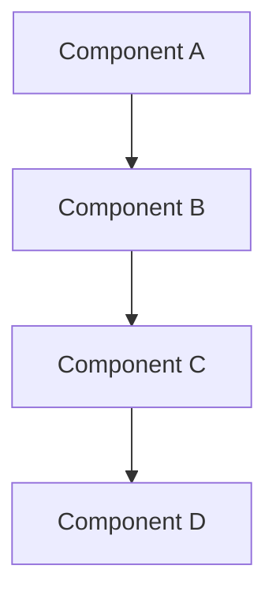

# Prompt to Generate Function Specification Document

## Master Prompt

Generate a comprehensive Function Specification Document based on the provided code/documentation.

## 1. Document Structure

Include the following sections:

### 1. Executive Summary
- Purpose statement
- Target audience
- Document scope

### 2. System Overview
- High-level architecture diagram using Mermaid (see format below)
- Technology stack summary
- Integration points

**Mermaid Diagram Format** (use exactly this format for rendering):
```

```
- Use flowchart TD (top-down) for best rendering
- Keep labels simple - avoid special characters like parentheses, quotes, pipes
- Use subgraph for grouping related components

### 3. Technical Architecture
- Microservices or monolith architecture
- API Framework: Spring Boot 3.x / JAX-RS
- Data formats: JSON (primary), XML (optional)
- Protocol: HTTPS (TLS 1.3)
- Authentication: OAuth 2.0 / JWT
- Documentation: OpenAPI 3.0
- Logging: ELK Stack
- Monitoring: Prometheus + Grafana

### 4. API Specifications
- Base URL structure for Production, UAT, and Development environments
- Complete endpoint overview table with HTTP methods (POST, GET, PUT, PATCH, DELETE)
- Detailed endpoint specifications observed in the system

For each endpoint include:
- HTTP method with color-coded badges
- Request headers (Content-Type, Authorization, X-Request-ID, X-Idempotency-Key)
- Request body examples in JSON
- Response examples with status codes (200, 201, etc.)
- Query parameters where applicable

### 5. Data Models
- Core Data Model table with fields:
  - data elements
  - database or xml schema as applicable
  - entity relation model if applicable
  - UML model if applicable

### 6. Product Types
- Table of supported features
- Include description for each

### 7. Security and Authentication (if applicable)
- OAuth 2.0 authentication flow with JWT tokens
- Token request/response examples
- Authorization scopes table
- Rate limiting table by user type
- Burst limits for each tier
- Throttling

### 8. Error Handling
- HTTP status codes if applicable
- Exception handling
- Usage description for each status code
- Standardized error response JSON format with:
  - status, timestamp, requestId
  - errorCode, message
  - errors array with field-level details

### 9. Business Rules
- Business rules and logic
- Business rules in highlighted box

### 10. Use Cases and Examples
- Use case description, users, personas
- JSON input and output
- Include business context and explanation

### 11. Non-Functional Requirements
- Performance metrics table
- Availability requirements

### 12. Appendices
- Glossary of terms
- Currency pair conventions table (if financial)
- Contact information (API support, technical issues)

---

## Styling Requirements

Use professional CSS styling with:
- Clean, modern font (Segoe UI, Tahoma)
- Maximum width container (1200px) centered
- Color scheme: Professional blues (#3498db), grays, and semantic colors
- Styled tables with hover effects
- Color-coded HTTP method badges (GET=blue, POST=green, PUT=orange, PATCH=teal, DELETE=red)
- Status code badges (green for success)
- Info boxes (blue), warning boxes (orange), success boxes (green) with left border accent
- Code blocks with dark background (#263238) and syntax-appropriate text color
- Table of contents with smooth scrolling
- Responsive design with print-friendly CSS
- ASCII art diagrams for architecture

---

## Output Format

Generate a complete, single-file HTML document that:
- Is self-contained (all CSS inline in <style> tag)
- Uses semantic HTML5 elements
- Includes proper meta tags
- Has a professional footer with copyright and confidentiality notice
- Includes smooth scrolling JavaScript for navigation
- Is print-optimized
- Uses proper table formatting for all structured data
- Includes visual hierarchy with h1-h5 headings

---

## Content Tone

- Professional and formal
- Enterprise-grade documentation style
- Technical but accessible
- Complete with realistic examples
- Industry-standard terminology
- Banking/financial services context (if applicable)

---

## Instructions

1. Analyze the provided code/documentation thoroughly
2. Extract all relevant technical details
3. Organize content according to the document structure above
4. Generate realistic examples based on the code patterns observed
5. Include all API endpoints, data models, and business rules found
6. Apply professional styling as specified
7. Ensure the document is comprehensive and production-ready
